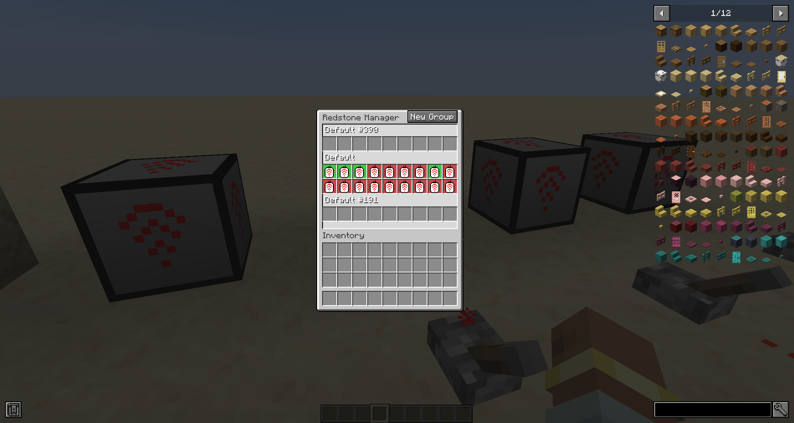

# Redstone Manager &nbsp;&nbsp; <a href="https://maven.igorilic.dev/#/releases/dev/igorilic/redstonemanager" target="_blank"></a>

Manage all your redstone switches from one central command block

Here is a sample image of how the mod is supposed to work, this is still all work in progress, and things are sure to
change:

<p align="center">
  
</p>

## Using the mod

Start by crafting a Manager and a Linker.

`Crouch + right click` with the Linker on a Lever to link them.

Open the manager and create your first group by clicking on the plus button.

Place the Linker inside the newly created group.

From within the Manager, you can now toggle that single lever on/off or toggle the entire group.

## For modpacks

The linker works on a tag system, where it looks if the block has a tag: `redstonemanager:linkable_items`.

If the block has that tag, it will allow the link to be created between them.

Afterward it is checking for the powered state of that block to get its state.

## For devs

You can add this mod to your project by adding this:

```
maven {
    name = "Gac Repository"
    url = uri("https://maven.igorilic.dev/releases")
}
```

And then adding this as a dependency:

```
implementation "dev.igorilic:redstonemanager:${rm_version}"
```

# Have suggestions?

If you have any suggestions that you think can improve the modpack, open an issue for it and let's have a discussion
about it.

Or join the discord server: https://discord.gg/7maXVvt2c4
