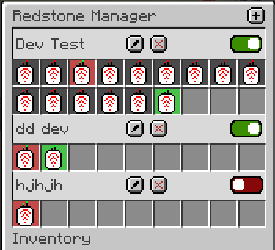

# Redstone Manager

Manage all your redstone switches from one central command block

Here is a sample image of how the mod is supposed to work, this is still all work in progress, and things are sure to
change:

  

